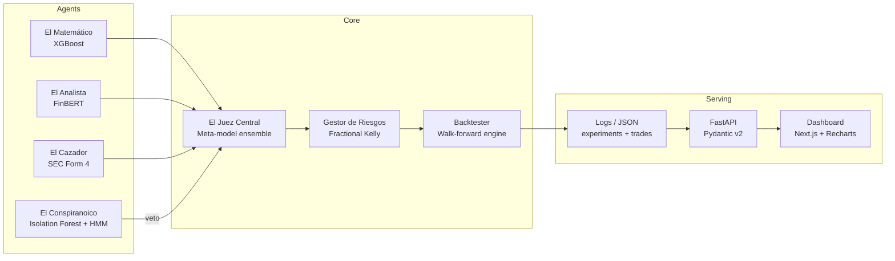

# MAS Trading System

An AI-powered multi-agent ensemble for daily trading decisions on U.S. equities. Four specialized agents analyze markets from isolated perspectives — technical patterns, news sentiment, insider activity, and regime detection — while a central Judge combines their votes into actionable signals validated through rigorous walk-forward backtesting.

**[Live Dashboard](#) · [API Docs (FastAPI)](#) · [Video Demo](#)**

---

## Architecture



### The Council of Agents

| Agent | Role | Technology | Output |
|---|---|---|---|
| **El Matemático** | Technical analysis — price and volume trends | XGBoost + Platt Scaling calibration | Calibrated probability p ∈ [0, 1] |
| **El Analista** | Sentiment from financial headlines | FinBERT (HuggingFace, ~438 MB) | Calibrated probability p ∈ [0, 1] |
| **El Cazador** | Insider trading detection via SEC filings | SEC EDGAR Form 4 parser | Binary signal: alert / silence |
| **El Conspiranoico** | Anomalous market regime detection | Isolation Forest + Hidden Markov Model | Veto signal: active / inactive |
| **Gestor de Riesgos** | Position sizing and emergency exits | Fractional Kelly (ρ=0.5) + ATR stop-loss | Capital fraction f* ∈ [0, 0.15] per ticker |
| **El Juez Central** | Final trading decision from weighted votes | Logistic regression meta-model | BUY / SELL / HOLD |

---

## Results

### Walk-Forward vs Holdout vs Baselines

Results from the canonical experiment. Walk-forward uses expanding training windows; the holdout period (2025-01-01 onward) was never seen during model selection.

| Metric | Walk-Forward (MAS) | Holdout (MAS) | Buy & Hold | SMA Crossover |
|---|---|---|---|---|
| **Sharpe Ratio** | — | — | — | — |
| **Max Drawdown** | — | — | — | — |
| **Calmar Ratio** | — | — | — | — |
| **Annualized Return** | — | — | — | — |
| **Win Rate** | — | — | — | — |

> Fill in with actual values after running the canonical experiment. Values are shown live on the [dashboard](#).

---

## Quick Start

### One-command setup (Docker)

```bash
cp .env.example .env
docker-compose up
```

- **Dashboard:** http://localhost:3000
- **API docs:** http://localhost:8000/docs
- **Health check:** http://localhost:8000/health

### Local development — normal run

Flujo habitual para levantar el dashboard en local (desde la raíz del repo `trading/`).

#### 1. Primera vez (o tras clonar)

```bash
# Python
python -m venv .venv
.venv\Scripts\activate          # Windows
# source .venv/bin/activate     # macOS/Linux
pip install -r requirements.txt

# Variables de entorno (opcional; los defaults sirven en local)
copy .env.example .env          # Windows
# cp .env.example .env          # macOS/Linux

# Frontend
cd dashboard/frontend
npm install
cd ../..
```

#### 2. Preparar datos del dashboard (cuando falten métricas, equity curve o modelos)

Ejecutar **con el venv activado**, en este orden:

```bash
python -m scripts.setup_models
python -m scripts.generate_dashboard_data
python -m scripts.generate_xai_artifacts
```

- `setup_models` — serializa modelos en `models/` y reconstruye la equity curve.
- `generate_dashboard_data` — escribe `logs/dashboard/equity_curve.csv` y métricas JSON.
- `generate_xai_artifacts` — genera SHAP y diagrama de calibración en `dashboard/api/static/`.

> Solo hace falta repetir este bloque si cambias experimentos, modelos o quieres refrescar los artefactos XAI.

#### 3. Levantar API y frontend (dos terminales)

**Terminal 1 — API (puerto 8000):**

```bash
.venv\Scripts\activate
uvicorn dashboard.api.main:app --reload --host 0.0.0.0 --port 8000
```

**Terminal 2 — Frontend (puerto 3000):**

```bash
cd dashboard/frontend
npm run dev
```

Abrir **http://localhost:3000** (Lab, Desk, Experiments, etc.). La API queda en **http://localhost:8000/docs**.

#### 4. Paper trading diario (días hábiles NYSE)

Tras el cierre de mercado, actualiza decisiones, posiciones, **curva de equity del Lab** y artefactos XAI.

```bash
.venv\Scripts\activate
python run_daily.py
```

**Comportamiento por defecto (catch-up automático):** detecta el último día con datos (`paper_equity.csv`, logs `YYYY-MM-DD.jsonl` o `positions_current.json`) y procesa **todos los días hábiles NYSE pendientes hasta ayer**.

- En **fin de semana o festivos** no hay días hábiles en el rango → sale con `up_to_date` o `market_closed`.
- Cada ejecución exitosa añade puntos a `paper_equity.csv` y al final regenera `equity_curve.csv` una sola vez.
- Solo ayer (útil en cron diario): `python run_daily.py --no-catch-up`
- Un día concreto: `python run_daily.py --date 2026-06-26`
- Reprocesar días que ya tienen log: `python run_daily.py --force`

Si corriste `run_daily` varios días **antes** de tener tracking de equity, rellena la curva histórica con:

```bash
python -m scripts.backfill_paper_equity --from 2026-06-19 --to 2026-06-30
```

#### Resumen rápido (día a día)

```bash
# Terminal 1
.venv\Scripts\activate && uvicorn dashboard.api.main:app --reload --port 8000

# Terminal 2
cd dashboard/frontend && npm run dev

# Tras cierre NYSE (lun–vie), opcional:
python run_daily.py
# equivalente explícito solo-ayer: python run_daily.py --no-catch-up
```

### Manual setup (referencia mínima)

```bash
# Backend
python -m venv .venv
.venv\Scripts\activate          # Windows
# source .venv/bin/activate     # macOS/Linux
pip install -r requirements.txt

# Frontend
cd dashboard/frontend
npm install
npm run dev

# API (otra terminal, desde la raíz del repo)
uvicorn dashboard.api.main:app --reload
```

### Daily pipeline (cron en servidor)

Después del deploy en VPS, programar el pipeline diario post-cierre NYSE:

```bash
# crontab -e
0 23 * * 1-5 cd /app && python run_daily.py >> logs/cron.log 2>&1
```

---

## Technology Stack

| Layer | Technology | Justification |
|---|---|---|
| **Agents** | Python, XGBoost, FinBERT, Isolation Forest, HMM | Isolated models with calibrated outputs — no shared state |
| **Risk Management** | Fractional Kelly (ρ=0.5) + ATR stop-loss | Position sizing from edge magnitude, capped at 15% per ticker |
| **Backtesting** | Custom walk-forward engine | Anti-leakage by design — expanding windows, no future data |
| **API** | FastAPI + Pydantic v2 + slowapi | Typed schemas → OpenAPI → auto-generated TypeScript types |
| **Dashboard** | Next.js 16, React 19, TanStack Query, Recharts, Tailwind 4 | SSR, stale-while-revalidate caching, interactive charts |
| **Data** | yfinance, Alpaca News API, SEC EDGAR | Free APIs with documented T-1 lag |

---

## Asset Universe

40 Nasdaq 100 stocks + 6 diversification ETFs, frozen as of January 1, 2018.

| Class | Tickers | Cap per ticker | Portfolio cap |
|---|---|---|---|
| Equity (Nasdaq) | 40 stocks | 15% | 80% |
| Bonds | TLT, IEF | 20% | 30% |
| Gold | GLD | 10% | 10% |
| Defensive | XLU, XLP | 15% | 20% |
| International | EFA | 10% | 10% |

---

## Dashboard Pages

| Route | Purpose |
|---|---|
| `/` | Landing page — system overview, holdout metrics, agent cards |
| `/lab` | Walk-forward results, equity curve, drawdown, XAI (SHAP + calibration) |
| `/desk` | Live paper trading — council verdict, risk allocation, trade log |
| `/experiments` | All experiment runs compared side-by-side |
| `/architecture` | System diagram, tech stack, known limitations |

---

## Tests

```bash
# Python tests (backtester, agents)
pytest tests/ -v

# Frontend tests (React components)
cd dashboard/frontend
npm test
```

### Critical test coverage

- **Anti-leakage:** no feature at time T uses data from T+1
- **Commission integrity:** same-day round-trip always loses money
- **Reproducibility:** same seed → identical Sharpe Ratio
- **Kelly bounds:** f* ≤ 0 never triggers BUY; f* never exceeds 15% cap
- **HealthDot:** shows red when pipeline reports error
- **Empty states:** council table shows contextual message before paper trading starts
- **Base-100 normalization:** first equity curve point is exactly 100

---

## Reproducibility

All results are deterministic with `random_seed: 42` in `config.yaml`. Clone the repo, run the backtest, and you should get the exact same Sharpe Ratio as shown on the dashboard.

```bash
pytest tests/test_backtester.py::test_reproducibility_same_seed -v
```

---

## Known Limitations

These are documented constraints, not bugs. Honest acknowledgment demonstrates engineering maturity.

| Limitation | Detail |
|---|---|
| **T-1 data lag** | All signals use end-of-day data from free APIs. Decisions apply to next-day open. |
| **Survivorship bias** | Universe frozen to Jan 2018 composition. Includes 8 underperformers (INTC, GILD, BIIB, WBA, BIDU, PYPL, ILMN) to mitigate, but the bias is not fully eliminated. |
| **Paper trading only** | No real broker execution. Commissions simulated at 0.08% per leg. No slippage model. |
| **Daily signals only** | One signal per ticker per day. No intraday or multi-timeframe analysis — by design, to avoid mixing incompatible signal horizons. |

---

## Project Structure

```
trading/
├── agents/                  # Agent implementations
├── backtester/              # Walk-forward engine
├── dashboard/
│   ├── api/                 # FastAPI backend
│   │   ├── main.py
│   │   ├── schemas.py       # Pydantic models (source of truth)
│   │   └── routers/         # historical, live, experiments
│   └── frontend/            # Next.js 16 dashboard
│       └── src/
│           ├── app/         # Pages: /, /lab, /desk, /experiments, /architecture
│           ├── components/  # React components (lab/, desk/, ui/)
│           └── lib/         # API hooks, utils
├── data/                    # Raw and processed market data
├── experiments/             # Walk-forward experiment results
├── logs/                    # Trade logs, positions, errors
├── models/                  # Serialized models + registry.json
├── config.yaml              # Single source of truth for all parameters
├── docker-compose.yml       # One-command deployment
└── requirements.txt         # Python dependencies
```

---

## License

This project is developed as a portfolio piece demonstrating multi-agent AI systems applied to quantitative finance. Not financial advice.
