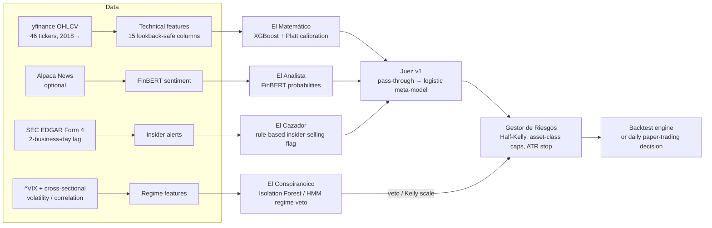

# MAS Trading — a multi-agent council for daily stock signals


A research-grade trading system where several specialised agents (an XGBoost "mathematician", an
insider-selling watcher, a market-regime anomaly detector, an optional FinBERT news reader) vote on
40 Nasdaq-100 stocks plus 6 diversification ETFs. A meta-model judge blends the votes, a Half-Kelly
risk manager sizes positions, and everything is validated with strict walk-forward testing against
Buy & Hold and SMA-crossover baselines. A frozen model runs daily in paper trading and a
FastAPI + Next.js dashboard shows what the council decided and why.

> Paper trading only. Nothing here is investment advice and the system is not designed to trade real money.

---

## Results at a glance

**Walk-forward, out-of-sample 2021–2024** (train ≥3 years, validate 1 year, roll forward, 1 005 trading days, 0.08 % commission per side, €10 000 start):

| Strategy | Total return | Annualised | Sharpe | Max drawdown | Calmar | Win rate |
|---|---:|---:|---:|---:|---:|---:|
| **MAS (Matemático + Cazador + Conspiranoico)** | **+86.6 %** | **17.8 %** | **0.861** | -29.6 % | **0.60** | 52.3 % |
| Buy & Hold (equal-weight universe) | +67.9 % | 15.3 % | 0.723 | -31.4 % | 0.49 | 52.4 % |
| SMA crossover 20/50 | +14.5 % | 4.2 % | 0.329 | -22.3 % | 0.19 | 54.1 % |

| Window | Return | Sharpe | Max DD | Win rate |
|---|---:|---:|---:|---:|
| 2021 | +24.0 % | 1.426 | -10.2 % | 54.8 % |
| 2022 | -21.2 % | -0.765 | -29.3 % | 43.4 % |
| 2023 | +44.6 % | 2.334 | -10.2 % | 53.6 % |
| 2024 | +35.0 % | 1.505 | -14.4 % | 57.1 % |

**Holdout 2025** (touched exactly once, after all tuning was frozen):

| Strategy | Return | Sharpe | Max DD | Calmar | Win rate |
|---|---:|---:|---:|---:|---:|
| MAS | **+26.8 %** | 1.148 | -20.8 % | **1.31** | **60.2 %** |
| Buy & Hold | +23.9 % | 1.213 | -18.3 % | 1.30 | 57.3 % |

**Paper trading** started 2026-01-02 with €10 000; the simulated book stood at €11 662 (+16.6 %) on 2026-08-07.

The honest reading: the system beats both baselines on Sharpe, Calmar and total return out-of-sample,
but 2022 (a bear market) is still a losing year and the edge over Buy & Hold in strong bull years is thin.
See [Limitations](#limitations).

---

## How it works



### The council

| Agent | Role | Method |
|---|---|---|
| **El Matemático** | Probability that tomorrow's close is up, per ticker | XGBoost on 15 technical features (returns, RSI, MACD, Bollinger, ATR, volume ratio, SMA ratios), Platt-calibrated with 5-fold CV |
| **El Analista** *(optional)* | Same target from news headlines | FinBERT over Alpaca News, daily aggregation, calibrated. Needs `ALPACA_API_KEY` |
| **El Cazador** | Bearish flag when C-level insiders dump > 20 % of their holdings | SEC EDGAR Form 4 XML parsing, NYSE-calendar lag so the signal is only visible when the market could have seen it |
| **El Conspiranoico** | Market-wide "something is off" veto | Isolation Forest (or 3-state Gaussian HMM, or hybrid) on VIX + realised-vol + correlation + volume features. Binary veto or soft Kelly scaling |
| **Juez v1** | Combines agent probabilities | Pass-through in the first window, then a logistic meta-model trained only on the previous window's out-of-sample predictions |
| **Gestor de Riesgos** | Position sizing and exits | Half-Kelly `f* = ρ·(p − (1−p)/b)`, per-asset-class caps (equity / bond / gold / defensive / international), 2×ATR stop-loss |

### Methodology guard-rails

- **Walk-forward validation, never a single split.** Windows: train 2018→N, validate year N+1, for N+1 ∈ {2021, 2022, 2023, 2024}. Positions carry across windows (no artificial year-end liquidation).
- **No look-ahead.** All features use only data up to day *T*; a test greps `features.py` for forbidden `shift(-…)` on inputs. Insider filings are lagged by NYSE business days. VIX percentiles for veto thresholds are computed on the training window only.
- **Judge trained out-of-sample.** The meta-model only ever sees predictions the agents made on data they were not trained on.
- **Holdout discipline.** 2025 was reserved from day one and evaluated once.
- **Reproducibility.** Global seeds, every run saves `config.yaml` + `results.json` + equity curve under `experiments/`, frozen models are hashed (SHA-256) in `models/registry.json`.
- **Baselines always on.** Buy & Hold and SMA 20/50 are computed over the exact same out-of-sample dates.

### Experiment campaign

Eleven configuration experiments (`profiles/experiments/`) were run on top of the base stack
(Matemático + Cazador + Conspiranoico, positions carried across windows). Out-of-sample Sharpe 2021–2024,
from `reports/experiment_grid_carry.json` and the run directories under `experiments/`:

| Experiment | Idea | Sharpe | Verdict |
|---|---|---:|---|
| Base stack | Isolation-Forest binary veto, meta-model judge | 0.583 | Reference |
| **Exp1 `menos_friccion`** | 1 % Kelly floor, entry filter `p ≥ 0.45`, 3-day sell hysteresis | **0.86–0.91** | **Canonical.** Less churn, best Sharpe and Calmar |
| Exp2 wider stop-loss | 3×ATR instead of 2×ATR | 0.635 | Small gain alone, none on top of Exp1 |
| Exp3 soft veto | Scale Kelly by anomaly tier instead of all-or-nothing | 0.586 | Best drawdown (-26.5 %), lower Sharpe |
| Exp4 Cazador as risk modulator | Insider alert halves Kelly instead of feeding the judge | 0.502 | Worse |
| Exp5 Kelly boost | ρ = 0.6 when VIX is low and regime is normal | 0.593 | More return, more drawdown |
| Exp6 / Exp9 judge pass-through | Skip the meta-model | 0.502 | Worse — the judge earns its keep |
| Exp7 defensive rotation | Move 30 % into TLT/IEF/GLD on severe veto | 0.491 | Worse |
| Exp8 veto percentile p5 → p7 | Looser veto | 0.602 | Marginal |
| Exp10 carry positions | Do not liquidate between walk-forward windows | — | Large fix, now the default for every row above |
| Exp11 HMM regime detector | 3-state Gaussian HMM instead of Isolation Forest (with Exp1) | 0.882 | Comparable to Exp1, not better |

Combinations (Exp1+Exp3+Exp8 = 0.861 with -28 % DD, Exp1+Exp3+HMM = 0.875 with -21.8 % DD) trade a little
Sharpe for drawdown; Exp1 alone stayed canonical because it is the simplest configuration that wins on the
primary metric. Selection rule and reproduction steps: [`experiments/README.md`](experiments/README.md).
The complete decision log lives in [`docs/MEMORIA.md`](docs/MEMORIA.md) (Spanish).

---

## Dashboard

`dashboard/api` (FastAPI, rate-limited, CORS-configurable) serves the historical results, XAI artifacts and the live paper-trading state; `dashboard/frontend` (Next.js 16, React 19, TanStack Query, Recharts, Tailwind 4) renders them.

| Route | What you see |
|---|---|
| `/` | Headline metrics, equity curve vs baselines across walk-forward → holdout → paper |
| `/lab` | Per-window metrics, SHAP beeswarm for the Matemático, reliability (calibration) diagram |
| `/desk` | Live paper-trading desk: open positions, today's council verdict per ticker, trade log |
| `/experiments` | All experiment runs side by side |
| `/architecture` | Interactive explanation of the agents and data flow |

---

## Quick start

Requirements: Python 3.11+, Node 20+ (dashboard only). Tested on Windows and Linux.

```bash
git clone https://github.com/dipromm/trading.git && cd trading
python -m venv .venv && source .venv/bin/activate      # Windows: .venv\Scripts\activate
pip install -r requirements.txt
cp .env.example .env                                    # fill SEC_USER_AGENT (and Alpaca keys if you want --analista)
```

### 1. Run the walk-forward backtest

```bash
# Canonical configuration (Matemático + Cazador + Conspiranoico, Exp1 profile)
python run.py --cazador --conspiranoico --profile profiles/exp1_menos_friccion.yaml

# Matemático only, or add the news agent
python run.py
python run.py --analista --cazador --conspiranoico
```

The first run downloads ~8 years of OHLCV for 46 tickers, VIX and SEC Form 4 filings into `data/cache/`
(a few minutes; later runs are cached). Each run prints the per-window table and the baseline comparison
and writes `experiments/<name>_<timestamp>/{config.yaml,results.json,equity_curve.csv}`.

### 2. Holdout 2025

```bash
python scripts/run_holdout_2025.py --profile profiles/exp1_menos_friccion.yaml
```

### 3. Freeze models and paper-trade

```bash
python scripts/setup_models.py             # trains on 2018–2024, writes models/*.joblib + registry.json
python run_daily.py                        # decisions for the last NYSE close (catches up missed days)
python run_daily.py --date 2026-03-02      # a specific day
```

`run_daily.py` writes `logs/trades/YYYY-MM-DD.jsonl` (one decision per ticker with every agent's vote),
`logs/positions_current.json` and `logs/dashboard/paper_equity.csv`. Schedule it after the US close
(cron / Task Scheduler) to keep the desk up to date.

### 4. Dashboard

```bash
python scripts/generate_dashboard_data.py  # metrics + aligned baseline curves
python scripts/generate_xai_artifacts.py   # SHAP beeswarm + reliability diagram
uvicorn dashboard.api.main:app --reload    # http://localhost:8000/docs

cd dashboard/frontend && npm install && npm run dev   # http://localhost:3000
```

Or with Docker: `docker compose up --build` (API on 8000, frontend on 3000).

### 5. Tests

```bash
pytest                                   # 362 tests: Kelly maths, engine, agents, anti-leakage, data integrity
cd dashboard/frontend && npm test        # frontend unit tests
```

---

## Repository layout

```
trading/
├── run.py                  Walk-forward backtest entry point (agents, profile, baselines)
├── run_daily.py            Daily paper-trading pipeline
├── config.yaml             Single source of truth for every parameter
├── profiles/               YAML overrides: swing / long_term / day_simulated / exp1_menos_friccion (canonical)
│   └── experiments/        Exp2–Exp11 profiles from the experiment campaign
├── mas/                    Core package
│   ├── agents/             matematico, analista, cazador, conspiranoico, gestor_riesgos
│   ├── judge/              judge_v1 (pass-through → logistic meta-model)
│   ├── backtester/         engine (commissions, stops, caps), walk_forward, metrics
│   ├── baselines/          buy_and_hold, sma_crossover
│   ├── data/               downloader, features, regime (VIX), insiders (SEC EDGAR), news (Alpaca)
│   └── utils/              config_loader (profile merge), reproducibility, paper_equity
├── scripts/                setup_models, run_holdout_2025, generate_dashboard_data, generate_xai_artifacts,
│                           backfill_paper_equity, diagnose_*, run_experiment_grid_carry
├── dashboard/
│   ├── api/                FastAPI app, routers (historical / live / experiments), static XAI assets
│   └── frontend/           Next.js app
├── tests/                  pytest suite
├── data/universe_2018-01-01.csv   The fixed 46-ticker universe (40 equities + TLT, IEF, GLD, XLU, XLP, EFA)
├── experiments/            Every recorded run (config + results + equity curve) and the selection rule
├── reports/                Holdout and grid-search summaries
├── models/registry.json    Hashes and metadata of the frozen paper-trading models
├── logs/dashboard/         Generated metrics and equity curves consumed by the API
└── docs/                   PLAN.md (original design, Spanish) · MEMORIA.md (full decision log, Spanish)
```

## Configuration

Everything lives in `config.yaml`; a profile is a small YAML that overrides some keys and is applied with
`--profile`. The canonical profile is four lines:

```yaml
risk_manager:
  min_kelly_threshold: 0.01     # ignore allocations below 1 %
backtester:
  min_prob_to_buy: 0.45         # entry filter on the judge's probability
  sell_prob_threshold: 0.45
  sell_hysteresis_days: 3       # sell only after 3 consecutive weak days
```

Environment variables (`.env`): `SEC_USER_AGENT` (required by the SEC for `--cazador`), `ALPACA_API_KEY` /
`ALPACA_SECRET_KEY` (only for `--analista`), `ALLOWED_ORIGINS` (dashboard CORS).

## Limitations

- **2022 loses money.** The regime veto reduces but does not remove bear-market drawdown; the Sharpe edge comes from 2021/2023/2024.
- **Survivorship bias in the universe.** The 40 stocks were picked in 2018 terms but with today's knowledge of who is still in the Nasdaq-100.
- **Daily close-to-close, no intraday fills, no slippage model** beyond a flat 0.08 % commission.
- **El Analista is off in the canonical run**: news coverage before 2021 is sparse, and adding it to the full stack did not improve Sharpe.
- **Single asset universe, single horizon.** No options, no shorting, no leverage.
- The Juez v2 reinforcement-learning variant and the "Explorador" universe-rotation agent from the original plan were never built; the gate to justify them was not met.

## Documentation

- [`docs/PLAN.md`](docs/PLAN.md) — original design document: agents, phases, success criteria.
- [`docs/MEMORIA.md`](docs/MEMORIA.md) — technical logbook: every design decision, experiment result, pitfall and fix, phase by phase.
- [`experiments/README.md`](experiments/README.md) — how the canonical run was chosen and how to reproduce it.
